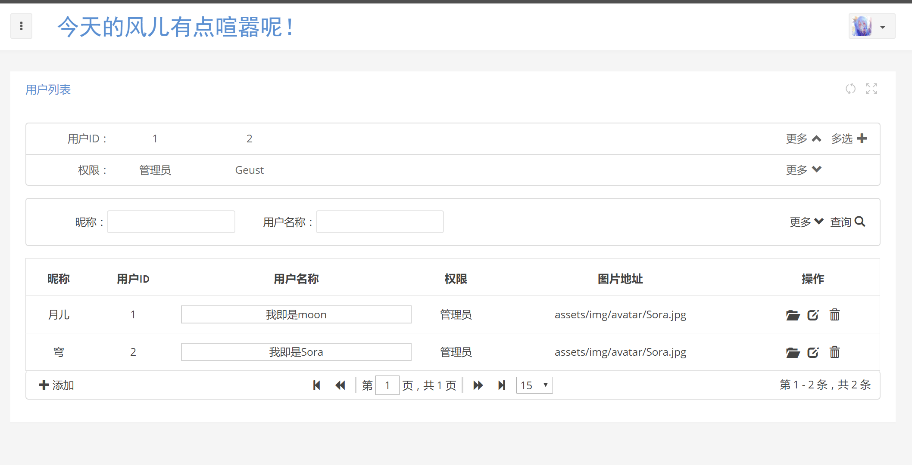

Reportingtool-go
================
The reportingtool is a project that presents database data on a table,tree or rect  based on requirements.  Its design was inspired by the another project
[Reporting-charp](https://github.com/hongxufeng/reportingtool-csharp)
. It includes front-end projects wrote with js,html,css  and back-end projects wrote with go.Some of the project's features include:

* It can  build quickly the website of the b/s framework
* Represents database date as table,tree or rect easily.
* You only need to render the content through a JS call.
* Configure the element display through the XML attribute configuration.
* Build the server quickly through the yaml configuration file(require the go environment).
* Custom extensions can be added on your own.
* An HTTP framework with a defined format.
## Unfinished project
This is a project that is still under development.When the project is mature, I will give you more details by English.How to use it in future? look [here](https://github.com/hongxufeng/reportingtool-csharp/blob/master/ReportingTool/ReadMe.docx).
I can only comment in Chinese for my broken English.Please forgive me.

## The difference between Vue.js
#### Advantage
* Seamless integration with database data,database data The data structure of the database does not need to be constructed again in js,just in XML!
* Idiots generate code,simply configure js and XML to generate the required content.
* Good for hiding data,sensitive information can be processed in the background.
* The format of the specified format can be developed.
* Write once,refer everywhere,don't need to be in a multifarious writing js, HTML.

#### Weakness
* This is just a simple table,tree or rect tool.
* Clearly not such as the vue.js flexibility,but you can make it by yourself.
* Some HTML is generated at the back end,vue.js focus on the data structure and generates HTML on the front end.(To some extent,It's advantage)


In this statement ,for the view of my limited level, I beg your pardon for my error and the wrong statement of this project.
## 使用须知
使用项目需先运行go build   然后在生成exe的地方运行reportingtool config.yaml

因项目使用 mysql 数据库 需增加依赖  go-sql-driver/mysql
在终端 运行命令go get github.com/go-sql-driver/mysql

增加第三方路由器  依赖
在终端 运行命令go get github.com/gorilla/mux   //以前的路由功能太少，不用了


第三方XML解析  go package
go get github.com/beevik/etree


log 打印包
go get github.com/hongxufeng/fileLogger

yaml解析  go get gopkg.in/yaml.v2


redis做缓存数据库  go get -u github.com/go-redis/redis  


数据库链接配置在config.yaml格式如下：

mysql: user:password@/dbname

redis: redis://:qwerty@localhost:6379/1

如何使用请参考[mysql](https://github.com/go-sql-driver/mysql/wiki/Examples)和[redis](https://godoc.org/github.com/go-redis/redis#example-ParseURL)


修改服务器请求地址 在assets/js/core/ReportingTool.js的16行
var serverURL="http://localhost:8080/ReportingTool"

被墙第三方包下载方法https://www.golangtc.com/download/package
当然可以翻墙，即使我也是这么做的
## Note
1.由于涉及前后端交互，如果不涉及账号密码，会造成后端参数解析问题等等
思前向后  决定加入用户登录功能   以求go后端框架  完整  不需要再次改动
并决定用cookie保存信息，实现自动登录

涉及用户名密码  数据库结构问题  建表语句等会之后在代码中贴出

登录页面在https://hongxufeng.github.io/reportingtool-go/web/pages_login.html

2.客户端提交 md5(password) 密码（此方法只是简单保护了密码，是可能被查表获取密码的）。服务端数据库通过 md5(salt+md5(password)) 的规则存储密码，该 salt 仅存储在服务端，且在每次存储密码时都随机生成。这样即使被拖库，制作字典的成本也非常高。密码被 md5() 提交到服务端之后，可通过 md5(salt + form['password']) 与数据库密码比对。此方法可以在避免明文存储密码的前提下，实现密码加密提交与验证。

3.准备写个彩蛋 可永久登录系统（完成，彩蛋用户   帐号wind密码shadow   如果用户注册人数多了  自增uid超过331805370，则彩蛋用户自动失效，并且新增加安全性验证，彩蛋用户需要符合某些条件，方能登录系统）备注：http没有绝对的安全，只是会增加破解难度，太复杂不弄了吧，有点心里安慰就行了！

传说中beego开发者大神astaxie的安全机制[seesion劫持](https://github.com/astaxie/build-web-application-with-golang/blob/master/zh/06.4.md)这些方法貌似也是隔靴搔痒而已，早想到到，完全拿下你的路由，再知道你的加密方式，完全防不住！安全性还没我的具有迷惑性，我本想判断用户IP，但如果用户各种游走，换IP是经常的事，并不能有好的用户体验，而且IP也能模拟，选择方法是验证useragent，一般验证了系统、内核、浏览器等信息（当然只是一部分，因为可能浏览器版本变化，useragent也会变），就可以判断是不是登录的那台机子发来的请求，换了浏览器都是不能验证通过的，当然这也是可以模拟的，其实防不住的.进行数据加密？加密在js有，防君子不防小人吗？可以用不对称加密，私钥和公钥？实在是懒得，其实是懒的，因为这个事实[md5弱点](https://baike.baidu.com/item/MD5/212708?fr=aladdin#4)，密码有完全安全的么，还是那句话，有点心理安慰就行了

2009年，冯登国、谢涛二人利用差分攻击，将MD5的碰撞算法复杂度从王小云的2^42进一步降低到2^21，极端情况下甚至可以降低至2^10。仅仅2^21的复杂度意味着即便是在2008年的计算机上，也只要几秒便可以找到一对碰撞。我想说谁你妹破解你这玩意玩！！

4.为避免繁杂的路由配置，决定路由配置分为验证用户登录和不验证用户两种，再根据反射，找寻相应的接口函数

5.要在请求数据时，增加loading panel  还有刷新数据时的  loading panel  以及表格内容放大

6.傻瓜式配置，决定把一些需要的参数，放在配置文件里

7.使用redis做缓存数据库，像账户验证的密码，登陆失败的次数等等，不能每次验证登录cookie都查mysql吧，还是决定使用redis，减少与关系数据库的交互，增加速度。

8.如果说一个后台系统没多少人登录，也不值得任何攻击，如此细致的考虑，安全验证、redis等等是完全没必要的，加之golang的天生并发特性，所以这种写法非常适合高并发的场景网站，做后台确实大材小用，但不得不说，谁保证以后的项目没有这种考虑。

9.浏览，编辑页面，这些操作增删改查数据库也要统一自动化，这也是常操作项。

## SHOW
现阶段XML配置说明
```go
<?xml version="1.0" encoding="utf-8" ?>
<tables>
    <table id="用户表"
           name="w_user_list" defaultorder="uid desc">
        <nickname search-type="true">昵称</nickname>
        <uid  formatter="FeedbackGetNumber">用户ID</uid>
        <username search-type="true">用户名称</username>
        <buttons>
            &lt;span class="glyphicon glyphicon-folder-open" title="浏览" onclick="view(this,'OBJ_ID')">&lt;/span>
            &lt;span class="glyphicon glyphicon-edit" title="编辑" onclick="edit(this,'OBJ_ID')">&lt;/span>
            &lt;span class="glyphicon glyphicon-trash" title="删除" onclick="deleteThis(this,'OBJ_ID')">&lt;/span>
        </buttons>
        <pagerbuttons>
            &lt;span class="rt-pager-btn" onclick="create()">
            &lt;span class="glyphicon glyphicon-plus" title="新增问卷">&lt;/span>添加
            &lt;/span>
        </pagerbuttons>
    </table>
</tables>
```
id="用户表" 是js请求的tableID 

name="w_user_list"  这个 是要查询的数据库中的表

defaultorder="uid desc" 默认查询顺序

```go
<nickname search-type="true">昵称</nickname>
<uid  formatter="FeedbackGetNumber">用户ID</uid>
<username search-type="true">用户名称</username>
 ```
 以上三个是w_user_list的字段，这个顺序，也是展示的顺序,而这个数据结构只需在这里配置（也无需前端的再次定义），其他的都写好了
 ```go
 <buttons>
      &lt;span class="glyphicon glyphicon-folder-open" title="浏览" onclick="view(this,'OBJ_ID')">&lt;/span>
      &lt;span class="glyphicon glyphicon-edit" title="编辑" onclick="edit(this,'OBJ_ID')">&lt;/span>
      &lt;span class="glyphicon glyphicon-trash" title="删除" onclick="deleteThis(this,'OBJ_ID')">&lt;/span>
 </buttons>
 ```
 是操作的button   注意xml转义
 
 ```go
  <pagerbuttons>
      &lt;span class="rt-pager-btn" onclick="create()">
      &lt;span class="glyphicon glyphicon-plus" title="新增问卷">&lt;/span>添加
      &lt;/span>
  </pagerbuttons>
 ```
 之后会在左下生成，可是增加用户，导出等按钮
 
 最后  放一张效果图
 
